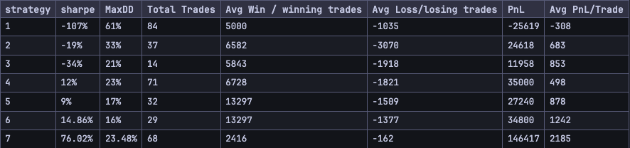

[comment]: # (This presentation was made with markdown-slides)
[comment]: # (This is a CommonMark compliant comment. It will not be included in the presentation.)
[comment]: # (Compile this presentation with the command below)
[comment]: # (mdslides presentation.md --include media)

[comment]: # (Set the theme:)
[comment]: # (THEME = white)
[comment]: # (CODE_THEME = base16/zenburn)
[comment]: # (The list of themes is at https://revealjs.com/themes/)
[comment]: # (The list of code themes is at https://highlightjs.org/)

[comment]: # "You can also use quotes instead of parenthesis"
[comment]: # 'Single quotes work too'
[comment]: # "THEME = white"

[comment]: # (Pass optional settings to reveal.js:)
[comment]: # (controls: true)
[comment]: # (keyboard: true)
[comment]: # (markdown: { smartypants: true })
[comment]: # (hash: false)
[comment]: # (respondToHashChanges: false)
[comment]: # (Other settings are documented at https://revealjs.com/config/)

### Exercise 2
## Trading Strategy Code Presentation

[comment]: # (A comment starting with three or more !!! marks a slide break.)
[comment]: # (!!!)

Predefined Backtesting Parameters:
- Moving Average Period: 50
- Backtesting Period: 2018-04-07 to 2023-05-21

[comment]: # (|||)

Risk Management Parameters
- Stoploss: 5%
- Stopwin: 30%

[comment]: # (|||)

Broker Parameters
- Starting Cash: 60000
- broker commission: 0.1% of trade value

[comment]: # (!!!)

Metrics Used to assess the Strategies:

----------

$$\text{Sharpe Ratio} = \frac{\text{Expected Return} - \text{Risk Free Rate}}{\text{Standard Deviation}}$$

Asseses Risk Adjusted Return of Asset

[comment]: # (|||)

**Max Drawdown**

------

 it measures the maximum loss an investor would have experienced if they invested in a particular cryptocurrency or portfolio at its peak and then sold it at the lowest point during a specified time period.

[comment]: # (|||)
- Avg win per winning trade: $$\frac{Profit}{\text{No of Win Trades}}$$
- Avg Loss per lost trade: $$\frac{Loss}{\text{No of Lost Trades}}$$

[comment]: # (|||)

- Cumulative Profit and Loss
- Avg PnL per Trade: $$\frac{\text{Cum PnL}}{\text{No of trades}}$$

[comment]: # (!!!)

Returns of Strategies

----------

[comment]: # (!!!)

Problems arise due to unavailability of finely granular data.
- less no of trades executed.
- order is executed on the next available data point after being placed which introduces difference in realized gains.

[comment]: # (!!!)

Description of Column Names

----------

Apart from usual OHLCV columns, our dataset contains:

- **signal**: bullish/bearish signal from TokenMetrics API
- **ma_20**: 20 period SMA of Close Price

[comment]: # (|||)

- **distance**: close price - ma_20
- **yearly_high**: 52week high
- **yearly_low**: 52week low

[comment]: # (|||)

- **diff**: 52 week high - 52 week low
- **top_5**: Is the distance value for current date is in top 5 percentile of all distance values in last 1 year i.e. is the deviation from the mean value significant

[comment]: # (!!!)

## Tools Used

- Backtrader Python Library (for Backtesting)

[comment]: # (!!!)

Find the jupyter notebook on the [Github Repository](https://github.com/shubxam/crypto-strategy-tm).

[comment]: # (!!!)
