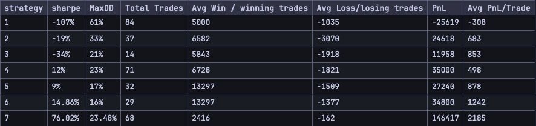

# Crypto Trading and Backtesting Setup using Python

>Default Parameters
> - Stoploss: 5%
> - Stopwin: 30%
> - Moving Average Period: 50
> - Backtesting Period: 2018-04-07 to 2023-05-21
> - Starting Cash: 60000
> - broker commission: 0.1% of trade value

Metrics used to assess the best strategy:
- Sharpe Ratio: Asseses Risk Adjusted Return of Asset
- Max Drawdown: Max Fall from Peak price over a defined period.
- (Profit)/(No of Win Trades) = Avg win per winning trade
- (Loss)/(No of Lost Trades) = Avg Loss per lost trade
- Cumulative Profit n Loss
- (Cum PnL)/(No of trades) = Avg PnL per Trade

